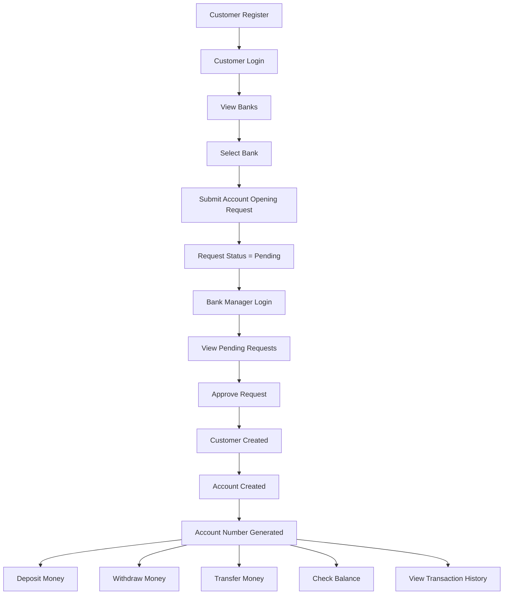

# Banking Management System

A Banking Management System developed using:

- Backend : Spring Boot
- Frontend : React JS
- Database : MySQL
- Security : Spring Security
- ORM : Spring Data JPA (Hibernate)
- Build Tool : Maven

---

## Features Implemented

- Customer Registration
- Customer Login
- Bank Manager Login
- View Available Banks
- Account Opening Request
- Manager Approval Workflow
- Customer Creation
- Account Creation
- Deposit Money
- Withdraw Money
- Transfer Money
- Transaction History
- Check Account Balance
- Exception Handling
- DTO-Based Architecture
- Layered Architecture (Controller-Service-Repository)

---

# Project Flow



---

# Complete Project Architecture

```text
                     BANKING MANAGEMENT SYSTEM

┌─────────────────────────────────────────────────────┐
│                     BANK MANAGER                    │
└─────────────────────────────────────────────────────┘

                │
                ▼

      View Pending Account Requests

                │
                ▼

         Approve Customer Request

                │
                ▼

          Create Customer Record

                │
                ▼

            Create Account

                │
      ┌─────────┼─────────┐
      ▼         ▼         ▼

 Deposit    Withdraw   Manage Accounts


========================================================

┌─────────────────────────────────────────────────────┐
│                     CUSTOMER                        │
└─────────────────────────────────────────────────────┘

                │
                ▼

            Register

                │
                ▼

              Login

                │
                ▼

           View Banks

                │
                ▼

           Select Bank

                │
                ▼

      Submit Account Opening Form

                │
                ▼

          Status = Pending

                │
                ▼

      Manager Approval Required

                │
                ▼

         Account Successfully Created

                │
      ┌─────────┼─────────┬──────────┐
      ▼         ▼         ▼          ▼

 Deposit   Withdraw   Transfer   Check Balance

                │
                ▼

      View Transaction History
```

---

# Current Implementation

## Predefined Banks

- HDFC Bank
- SBI Bank

## Predefined Managers

### HDFC Manager

```text
Email    : hdfcmanager@gmail.com
Password : hdfc123
```

### SBI Manager

```text
Email    : sbimanager@gmail.com
Password : sbi123
```

---

# Available APIs

## Authentication

### Customer Register

```http
POST /api/auth/register
```

### Login

```http
POST /api/auth/login
```

---

## Banks

### View All Banks

```http
GET /api/banks/all
```

---

## Customer

### Submit Account Opening Request

```http
POST /api/customer/account-opening
```

---

## Bank Manager

### View Pending Requests

```http
GET /api/manager/pending-requests
```

### Approve Request

```http
PUT /api/manager/approve/{requestId}
```

---

## Transactions

### Deposit

```http
POST /api/transaction/deposit
```

### Withdraw

```http
POST /api/transaction/withdraw
```

### Transfer

```http
POST /api/transaction/transfer
```

### Transaction History

```http
GET /api/transaction/history/{accountNumber}
```

### Check Balance

```http
GET /api/transaction/balance/{accountNumber}
```

---

# Database Flow

```text
USER
│
├── BANK_MANAGER
└── CUSTOMER

BANK
│
├── BANK_MANAGER
├── CUSTOMER
├── ACCOUNT
└── ACCOUNT_OPENING_REQUEST

ACCOUNT
│
└── TRANSACTION
```

---

# Entity Relationship Diagram

```text
User
│
├── userId
├── fullName
├── email
├── password
├── role
└── active

        │
        │ One-To-One
        ▼

BankManager
│
├── managerId
├── contactNumber
├── active
└── bank

        │
        │ Many-To-One
        ▼

Bank
│
├── bankId
├── bankName
├── ifscCode
├── branchName
├── address
└── active

        │
        ├────────────► Customer
        │
        ├────────────► Account
        │
        └────────────► AccountOpeningRequest

Customer
│
├── customerId
├── fullName
├── contactNumber
├── address
├── status
└── bank

        │
        │ One-To-Many
        ▼

Account
│
├── accountId
├── accountNumber
├── balance
├── accountType
├── accountStatus
├── openingDate
├── customer
└── bank

        │
        │ One-To-Many
        ▼

Transaction
│
├── transactionId
├── amount
├── transactionType
├── transactionTime
├── remarks
├── senderAccount
└── receiverAccount
```

---

# Tech Stack

### Backend

- Java 17
- Spring Boot
- Spring Data JPA
- Spring Security
- Hibernate
- Lombok

### Database

- MySQL

### Frontend

- React JS

### Tools

- Postman
- IntelliJ IDEA
- MySQL Workbench
- Git
- GitHub

---

# Future Enhancements

- JWT Authentication
- Role Based Authorization
- Admin Module
- PDF Statement Download
- File Upload (Aadhaar / PAN)
- Customer Activation / Deactivation
- Account Lock / Unlock
- Email Notifications
- Audit Logs
- Spring Boot Microservices Migration

---

# Author

Chintu Kodavath

Spring Boot | React JS | MySQL
